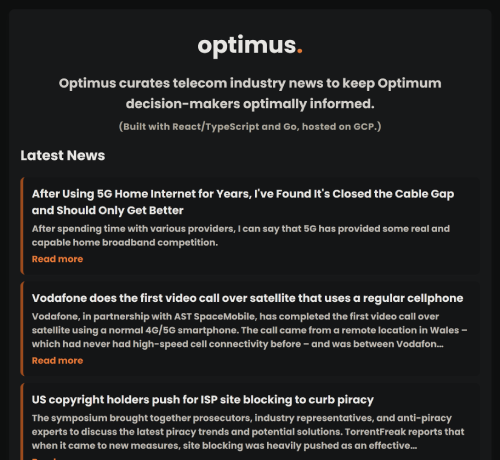

# Optimus

Optimus curates telecom industry news to keep Optimum decision-makers optimally informed. Built with Go and React/TypeScript, hosted on GCP.



### Prerequisites

Ensure you have the following installed:

- Docker
- Node.js & npm
- Go

### Backend Setup

1. Navigate to the API directory:
   ```sh
   cd optimus/api
   ```
2. Create a `.env` file with the required environment variables:
   ```sh
   NEWS_API_KEY=your_api_key_here
   ```
3. Build and run the backend using Docker:
   ```sh
   docker build -t optimus-api .
   docker run -d -p 8080:8080 --env-file .env optimus-api
   ```
4. Verify the backend is running:
   ```sh
   curl http://localhost:8080/news
   ```

### Frontend Setup

1. Navigate to the UI directory:
   ```sh
   cd optimus/ui
   ```
2. Create a `.env` file with the API URL:
   ```sh
   VITE_API_URL=http://localhost:8080
   ```
3. Install dependencies and start the development server:
   ```sh
   npm install
   npm run dev
   ```
4. Open the application in your browser at:
   ```
   http://localhost:5173
   ```

### Hosting

The app is hosted on **Google Cloud Platform** using **Google Cloud Run** and **Google Cloud Storage**.

##

See the READMEs in the UI API projects for more detail.
